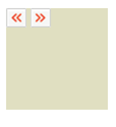

---

#  0918 월요일 TIL

## TIL(Today I Learned)

### 0. 목차

--- 

1. IR 기법

2. Sprite 기법

3. figure 태그

4. strong, em 태그

5. outline / outline-offset 속성 (CSS)

6. TIF

7. Reference

---

### 1. IR 기법

---

IR(Image Replacement)기법이란, 텍스트 정보를 유지한 채 이미지로 대체하는 기법으로서 이미지를 background 로 부여하고 텍스트를 보이지 않게 숨긴다.

> Html

```HTML
<h1 class="logo">CSS Zen Garden</h1>
```

> CSS 방법 1

```CSS
.logo {
    width: 100px; /* 이미지 너비 */
    height: 100px; /* 이미지 너비 */

    /* .logo::after의 위치를 위한 속성 */
    position: relative;

    /* 텍스트를 좀 더 작게 감추기 위한 속성 */
    box-sizing: border-box;
    padding-top: 20px; /**/
    font-size: 16px;
    text-align: center;
}

.logo::after {
    content: "";

    /* 대체 이미지 호출 */
    background: url("경로");

    /* 대체 이미지를 이용하여 텍스트의 위치를 가리기 위한 위치, 크기값 설정 */
    position: absolute;

    /* .logo를 가리기 위한 위치값 설정 */
    top: 0;
    left: 0;

    /* .logo의 위치만큼 차지한다. */
    width: 100%;
    height: 100%;
}
```

> CSS 방법 2

스프라이트 이미지 기법에 많이 쓰인다.

```CSS
.logo{
    /* 대체 이미지 불러오기 */
    background-image: url("경로");

    /* 이미지의 크기 */
    width: 100px;
    height: 100px;
    /* display: inline-block; */

    /* 텍스트를 이미지 박스 밖으로 밀어냄 */
    text-indent: 100px;

    /* 글자가 개행되는 것을 막음 */
    white-space: nowrap;

    /* 이미지 박스의 크기(100px * 100px) 에서 벗어나는 크기를 숨김 */
    overflow: hidden;
}
```

---

### 2. Sprite 기법

---

불러올 이미지를 여러개 두지 않고 하나로 통합하여 용량(호출 크기와 시간)을 줄이는 기법이다.


적용 예시는 다음과 같다.

> Html

```HTML
<div class="btn">
    <span class="btn-prev">이전</span>
    <span class="btn-next">다음</span>
</div>
```

> CSS

```CSS
.btn{
    background: rgb(224, 224, 192);
}

.btn-prev, .btn-next {
    /* 버튼의 크기 */
    width: 20px;
    height: 19px;
    display: inline-block;

    /* 스프라이트 이미지를 불러온다. */
    background-image: url("스프라이트 이미지 경로");

    /* 텍스트를 버튼의 크기만큼 밀어낸다. */
    text-indent: 20px;

    /* 텍스트의 개행을 막는다. */
    white-space: nowrap;

    /* 흘러넘치는 영역을 숨긴다. */
    overflow: hidden;
}


.btn-prev {
    /* 좌측 버튼의 이미지 좌표 값 */
    background-position: 0 0;
}

.btn-next {
    /* 우측 버튼의 이미지 좌표 값 */
    background-position: -40px 0;
}
```

아래와 같이 출력된다.




---

### 3. figure 태그

---

figure 태그는 어떤 정보나 문서, 이미지 등에 캡션을 달 수 있게 해주는 태그이다.

```html
<figure>

    <!-- aria-labelledby속성을 이용해 캡션과의 연관성을 나타내고 alt속성을 대체해준다. -->
    

    <!-- 상단 이미지에 대한 캡션 -->
    <figcaption id="news-thumbnail">W3C 리뉴얼</figcaption>

</figure>
```

---
### 4. strong, em 태그
---

strong, em, b, i 등의 태그는 본래 글귀의 강조를 위해 사용된 태그이지만 css스타일로 속성값을 초기화 한 뒤 화면 뒷단에서 텍스트를 강조하는데에도 쓰일 수 있다.

예를 들어, strong 태그가 들어간 문구를, voiceover를 통해 강하게 읽게 하여 시각장애인이 중요한 부분임을 인지할 수 있다.

이 외에도 컴퓨터 상에서 이 문구가 중요하다고 받아들이기 때문에 쓰일 수 있다.


---
### 5. outline / outline-offset 속성 (CSS)
---

- outline

    outline 속성은 보더의 바깥에 위치하며, 공간을 차지하지는 않는 외곽선을 말한다. border 처럼 라인의 두께, 라인의 종류, 라인의 색상을 지정할 수 있으며, focus를 둘 때 발생한다.

```css
    .btn {
        outline: 1px dotted #aaa;
    }
```

- outline-offset

    default 값은 0이며, border와 outline 사이의 여백을 부여할 수 있다.

```css
    .btn {
        border: 1px solid #aaa;
        outline: 1px dotted #aaa;

        outline-offset: 10px;
    }
``` 


---

### 6. TIF (Today I Found Out)

---

지원

```javascript
스프라이트 기법을 통해 문서의 경량화에 대해 고민해보게 되는 계기가 됐다.
```

윤재

```javascript
```

---

### 7. Reference

---

[null]

---
