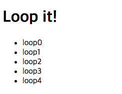

# Express Tutorial (ejs)

## EJS

**템플릿 엔진**이란, 템플릿과 데이터를 결합해 문서를 생성하는 프로그램, 혹은 라이브러리 템플릿을 작성할 때 사용하는 언어를 템플릿 언어라고 한다. `EJS`는 Node.js 생태계에서 가장 널리 쓰이는 템플릿 언어이다.

다음의 예시를 통해 `EJS`의 사용법을 알아본다.

`server.js`

```js
const express = require("express");
const app = express();
const bodyParser = require("body-parser"); // POST 관련 데이터를 처리한다.
const session = require("express-session"); // 세션 관리
const fs = require("fs"); // 나중에 파일을 열기 위해서 불러온다.

app.set("views", __dirname + "/views"); // 서버가 읽을 수 있도록 html의 위치를 지정해준다.
// 서버가 html을 렌더링할 때 ejs 엔진을 사용하도록 한다.
app.set("view engine", "ejs");
app.engine("html", require("ejs").renderFile); // ''

const server = app.listen(3000, () => {
  console.log("Express server has started on port 3000");
});

app.use(express.static("public")); // css 같은 정적 파일을 불러오는 메소드

app.use(bodyParser.json());
app.use(bodyParser.urlencoded());
app.use(
  session({
    secret: "@#@$MYSIGN#@$#$", // cookie를 임의로 변조하는 것을 방지하기 위한 sign 값
    resave: false, // 세션을 변경하지 않아도 언제나 저장할 지 정하는 값.  express-session docs에서는 이 값을 false 로 하는것을 권장하고 필요에 따라 true로 설정한다
    saveUninitialized: true // uninitialized 세션이란 새로 생겼지만 변경되지 않은 세션을 의미한다. docs에서는 true를 권장한다.
  })
);

const router = require("./router/main")(app, fs);
```

> Express 의 구버전에서는 cookie-parser 모듈도 불러와야했지만, 이젠 express-session 모듈이 직접 쿠키에 접근하므로 cookie-parser 를 더이상 사용 할 필요가 없다.

`./router/main.js`

```js
module.exports = function(app, fs) {
  app.get("/", function(req, res) {
    res.render("index", {
      // 뒤에 data가 되는 json 객체를 두번째 인자로 전달한다.
      title: "MY HOMEPAGE",
      length: 5
    });
  });
};
```

`EJS`는 다음과 같이 사용한다.

1. <% 자바스크립트 코드 %>
2. <% 출력 할 자바스크립트 객체 %>

아래 예시를 통해 학습한다.

`index.ejs`

```html
<!DOCTYPE html>
<html lang="en">
  <head>
    <% include ./header.ejs %>
  </head>
  <body>
    <% include ./body.ejs %>
  </body>
</html>
```

`header.ejs`

```html
<title><%= title %></title>
<link rel="stylesheet" type="text/css" href="css/style.css" />
<script>
  console.log("header");
</script>
```

`body.ejs`

```html
<h1>Loop it!</h1>
<ul>
  <% for(let i = 0; i < length; i++) { %>
  <li><%= "loop" + i %></li>
  <% } %>
</ul>
```

결과물은 다음과 같이 출력된다.


