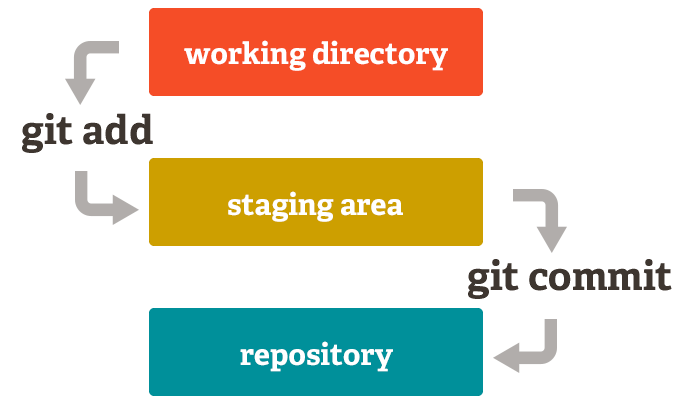

# git

---

>### git 처음 생성하기

---


<br>

1. git config --global user.name “<이름>”

    - git의 이름을 만든다.

2. git config --global user.email "<이메일 주소>”

   -  email 주소를 입력한다.

3. 경로에서 git ssh-kedgen 명령 실행

4. cat ~/.ssh/id_rsa.pub 에서 나오는 키 복사 (ssh-rsa ~)

5. 로그인 상태에서 https://github.com/settings/keys - New SSH Key 버튼 투른 후 키 등록

<br>

---

>### git push 및 pull

---

<br>

1. 로컽 저장소(컴퓨터)에 git 저장소 설치

```javascript
    git init //로컬저장소에 git 저장소를 생성
```
- git status 를 입력해 현재 저장소를 확인 할 수 있다.

<br>

2. git에 파일 저장하기

    git은 로컬저장소(작업 디렉토리) - 스테이징 영역(staging area) - .git 디렉토리(repository)의 세 영역으로 구분된다.
    
    

<br>

- git은 로컬저장소(작업 디렉토리): 현재 편집 중인 파일이 저장되는 영역
- 저장소에 저장할 변경 사항을 보관하는 임시 저장소
- 모든 작업 내역이 영구히 저장되는 저장소

```javascript
    git add . //파일 전체를 staging area에 올린다.
    git add [파일경로] //특정 파일을 staging area에 올린다.

    git commit -m "commit내용" 
    // staging area에 올라온 파일들을 "commit내용"이라는 묶음으로 repository에 올린다.
```

<br>

3. 원격 저장소와 연결하고 push하기

```javascript
    git remote add origin [저장소 주소]
    //git의 특정 원격 저장소와 연결시켜준다. 연결은 초기레 한 번만 하면 된다. 

    git push -u origin master
    //원격 저장소에 commit한 파일을 push(업로드) 해준다.
```

4. 원격저장소에서 pull하기 (받기)

```javascript
    git pull origin master //원격저장소에서 파일 받기.
```
<br>

